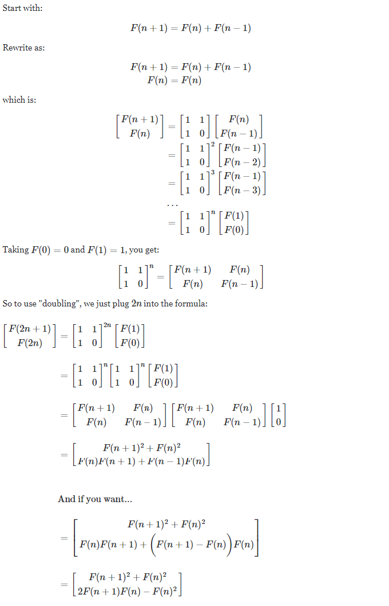

# LemonWay webservice_challenge Test by Achraf HAKIM

Poker planning (1 Developer = Achraf HAKIM, Total Hours = 9h):

Monday, July 20th 2020 => 17h-19h
Tuesday, July 21th 2020 => 17h-23h
Wednesday, July 22th 2020 => 17h-18h
Thursday, July 24th 2020 => 18h-20h

Project details & used Environments

* WebServices Project
Type : ASP.NET Web Service
Environment : .NET Framework 4.7.2
Utility : Create SOAP services (.asmx services)
Details : Contains 2 services for Fibonacci and XmlToJson + Controllers with the used algorithms + Logs using log4net library
Important Used libraries : log4net for Logging Exceptions and traces + Newtonsoft.Json for Json manipulations + System.Numerics to use BigInteger type

* UniTests Project
Type : MS Test (for unit testing)
Environment : .NET Core 2.1
Utility : Create Unit tests that communicate with WebServices (Project) controllers
Details : Contains 2 unit tests for Fibonacci and XmlToJson with the different test cases

* ConsoleClient Project
Type : Console App
Environment : .NET Framework 4.7.2
Utility : Create console client to test the different web services generated by WebServices (Project)
Details : Contains a console program displaying the different test cases applied on the web services

* WindowsFormClient Project
Type : Windows Form App
Environment : .NET Framework 4.7.2
Utility : Create console client to test the different web services generated by WebServices (Project) using an interface
Details : A timeout of 2 seconds is added while calling web services to display the loading correctly (can be removed in the LemonWayClient.cs)

Fibonacci used algorith explained
Fibonacci sequence for the nth element = F(n) = F(n-1) + F(n-2) when n > 2 and F(1) = 1, F(2) = 1
Based on that definition we can demonstrate the doubling method to get the used formula in the web service : 

To test the solution, please make sure to run the WebServices project before running the clients.