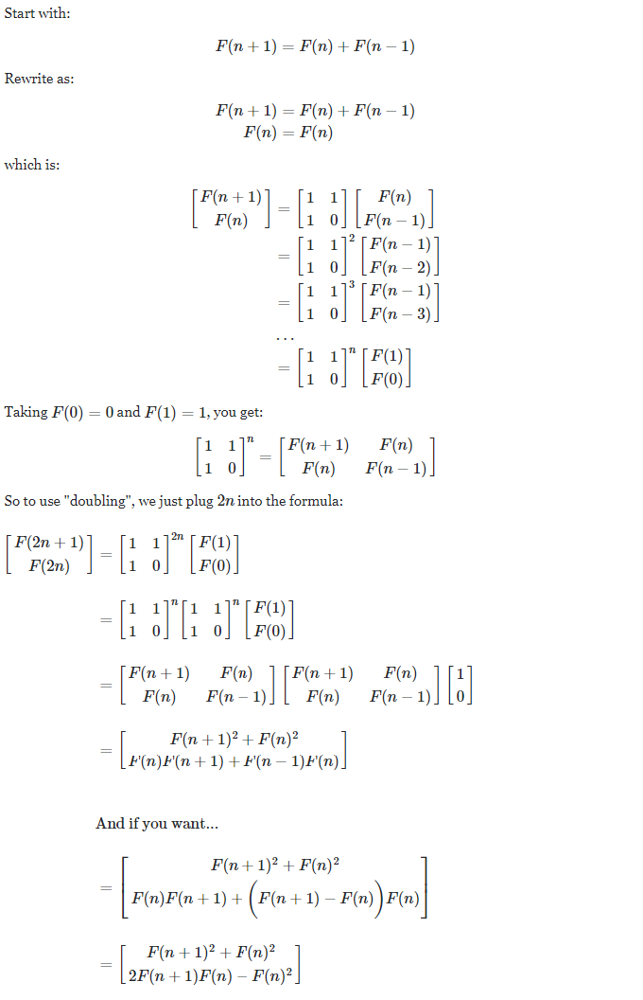

# LemonWay webservice_challenge Test by Achraf HAKIM


## 1) Poker planning 

-  Developer = Achraf HAKIM 
-  Total Hours = 11 hours
    -  Monday, July 20th 2020 &rarr; 17h-19h
    -  Tuesday, July 21st 2020 &rarr; 17h-23h
    -  Wednesday, July 22nd 2020 &rarr; 17h-18h
    -  Thursday, July 23rd 2020 &rarr; 08h-10h

## 2) Projects details & used Environments


### 2.1) WebServices Project

| Type| ASP.NET Web Service |
| ------ | ------ |
| __Environment__ | .NET Framework 4.7.2 |
| __Utility__ | Create SOAP services (.asmx services) |
| __Details__ | Contains : 2 services for Fibonacci and XmlToJson & Controllers with the used algorithms & Logs using log4net library |
| __Used libraries__ | log4net for Logging Exceptions and traces + Newtonsoft.Json for Json manipulations + System.Numerics to use BigInteger type |

### 2.2) UniTests Project

| Type| MS Test (for unit testing) |
| ------ | ------ |
| __Environment__ | .NET Core 2.1 |
| __Utility__ | Create Unit tests that communicate with WebServices (Project) controllers |
| __Details__ |  Contains 2 unit tests for Fibonacci and XmlToJson with the different test cases |

### 2.3) ConsoleClient Project

| Type| Console App |
| ------ | ------ |
| __Environment__ | .NET Framework 4.7.2 |
| __Utility__ | Create console client to test the different web services generated by WebServices (Project) |
| __Details__ | Contains a console program displaying the different test cases applied on the web services |

### 2.4) WindowsFormClient Project

| Type| Windows Form App |
| ------ | ------ |
| __Environment__ | .NET Framework 4.7.2 |
| __Utility__ | Create console client to test the different web services generated by WebServices (Project) using an interface |
| __Details__ | A timeout of 2 seconds is added while calling web services to display the loading correctly (can be removed in the LemonWayClient.cs) |


## 3) Fibonacci used algorithm explained


The objective is to calculate Fibonacci sequence for the nth element &rarr; F(n) 

##### Definition of Fibonacci Sequence :
F(n)= F(n-1) + F(n-2) when n > 2 , F(1) = 1 and F(2) = 1

Based on that definition we can proove the doubling method to get the used formula in the web service : 





## Important !

Please clone the project :

```
git clone https://github.com/AchrafHAK/LemonWay.git
```

Then open the **LemonWay.sln** solution

To test the solution, please make sure to run the **WebServices** project before running the **console** or the **WinForm** clients.
